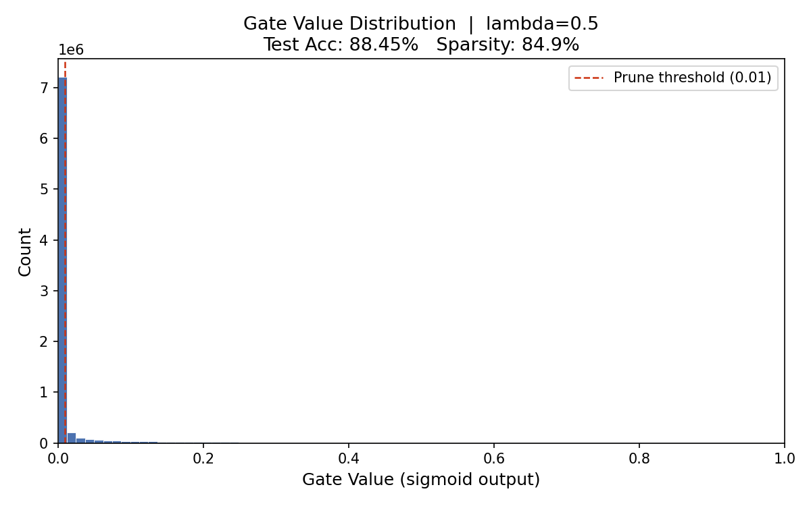
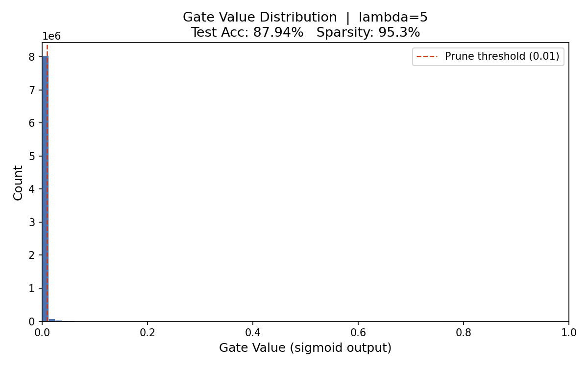
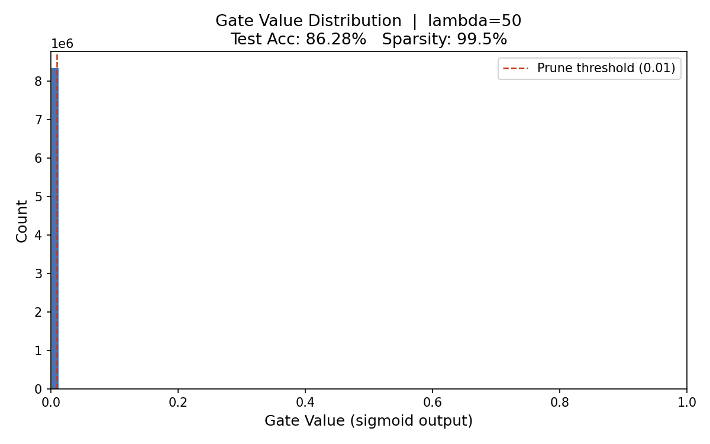
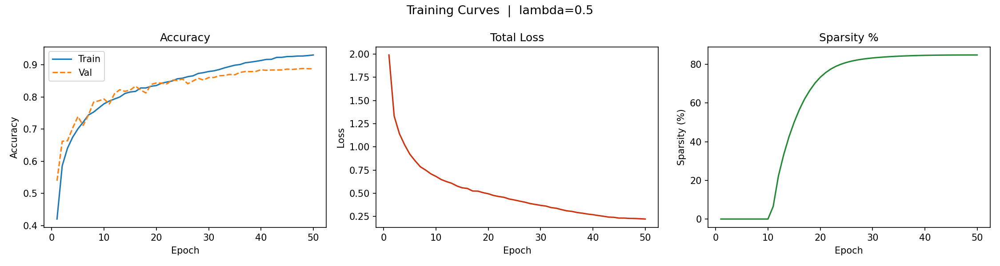
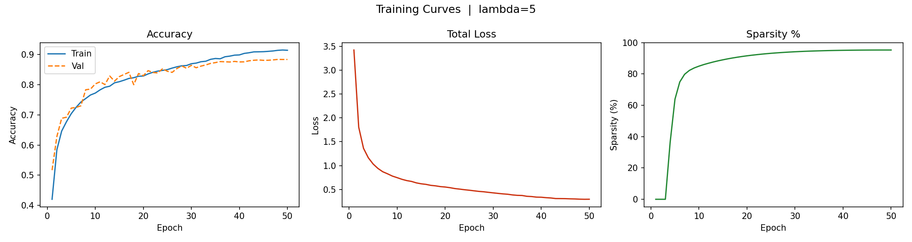
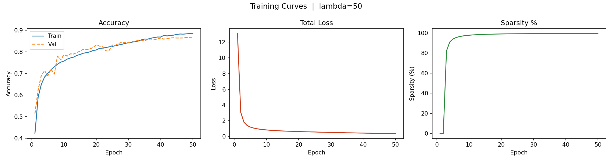

# Self-Pruning Neural Network

A production-style implementation of a **Self-Pruning Neural Network**
that dynamically learns sparse architectures during training using
learnable gates and L1 regularization.

This project demonstrates how neural networks can automatically remove
redundant connections during optimization, resulting in significantly
smaller and more efficient models without major loss in accuracy.

------------------------------------------------------------------------

# Project Highlights

-   Custom **PrunableLinear** layer with learnable gates
-   Dynamic pruning during training
-   L1 sparsity regularization
-   Mixed Precision Training (AMP)
-   Config-driven training pipeline
-   Logging and metrics tracking
-   Automatic sparsity computation
-   Model compression analysis
-   Visualization of gate distributions and training curves

------------------------------------------------------------------------

# Problem Statement

Large neural networks are often constrained by:

-   Memory usage
-   Compute cost
-   Deployment limitations

This project addresses these challenges by enabling the network to:

-   Identify redundant weights
-   Remove unnecessary connections
-   Maintain strong predictive performance

------------------------------------------------------------------------

# Architecture

Input → 512 → 256 → 128 → 10

All layers are implemented using:

PrunableLinear

Each weight is associated with a learnable gate:

pruned_weight = weight × sigmoid(gate_score)

If the gate approaches zero, the connection is effectively removed.

------------------------------------------------------------------------

# Dataset

CIFAR-10

-   60,000 images
-   10 classes
-   Standard benchmark dataset

------------------------------------------------------------------------

# Results

  Lambda   Test Accuracy   Sparsity (%)   Effective Model Size
  -------- --------------- -------------- ----------------------
  0.5      88.45%          84.9%          9.91 MB
  5        87.94%          95.3%          3.09 MB
  50       86.28%          99.5%          0.34 MB

------------------------------------------------------------------------

# Key Observations

Increasing lambda:

-   increases sparsity
-   slightly decreases accuracy
-   significantly reduces model size

Best trade-off:

Lambda = 5

Accuracy = 87.94%\
Sparsity = 95.3%

------------------------------------------------------------------------

# Project Structure

project/

config/ config.yaml

model/ prunable_linear.py network.py

training/ trainer.py losses.py

utils/ metrics.py logger.py seed.py

.gitignore
main.py\
REPORT.md\
README.md\
requirements.txt

------------------------------------------------------------------------

# Installation

Create virtual environment:

python -m venv venv

Activate environment:

Windows:

venv`\Scripts`{=tex}`\activate`{=tex}

Install dependencies:

pip install -r requirements.txt

------------------------------------------------------------------------

# Run Training

python main.py

------------------------------------------------------------------------

# Outputs Generated

Training produces:

- Test accuracy  
- Sparsity percentage  
- Model size reduction  
- Gate distribution plots  
- Training curves  

------------------------------------------------------------------------

# Example Visualizations

The following plots are automatically generated after training and saved in:

outputs/plots/

These visualizations demonstrate the pruning behavior and training dynamics for different values of λ.

------------------------------------------------------------------------

# Gate Value Distributions

## Lambda = 0.5

**Interpretation:**  
Moderate pruning — balanced sparsity and accuracy.

---

## Lambda = 5

**Interpretation:**  
Optimal trade-off between sparsity and accuracy.

---

## Lambda = 50

**Interpretation:**  
Aggressive pruning — extremely sparse network.

------------------------------------------------------------------------

# Training Curves

These plots show:

- Training vs Validation Accuracy  
- Total Loss convergence  
- Sparsity growth during training  

---

## Lambda = 0.5

---

## Lambda = 5

---

## Lambda = 50

------------------------------------------------------------------------

# Technologies Used

Python  
PyTorch  
NumPy  
Matplotlib  
Torchvision  

------------------------------------------------------------------------

# Future Improvements

- Structured pruning (neuron/channel-level)
- Model quantization
- ONNX export
- Distributed training
- Real-time inference benchmarking
- Hardware-aware pruning
- Edge deployment optimization

------------------------------------------------------------------------

# Author

**Pranav Vaish**    

LinkedIn: <https://www.linkedin.com/in/pranavvaish20>

------------------------------------------------------------------------

# License

MIT License
